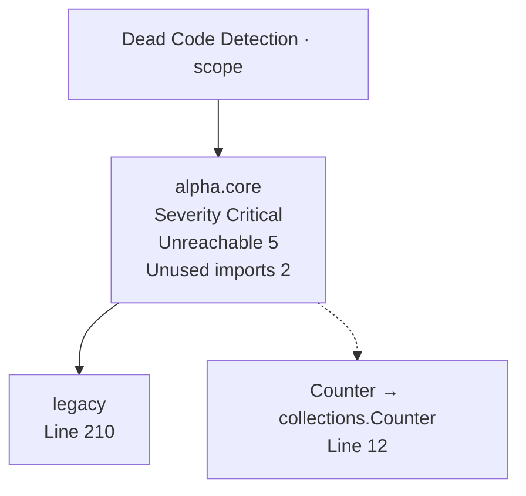

# Dead Code Detection View Spec

**Status:** Controls wired with scope-aware fallbacks (2025-11-13)

## Goal

Highlight modules that accumulate unused symbols so reviewers can prioritize clean-up of unreachable functions and imports that inflate maintenance cost or mask refactoring opportunities.

## Inputs

| Source | Fields Used | Notes |
| --- | --- | --- |
| `state.normalizedData.modules` (Map) | `moduleId`, `functions`, `unusedImports`, `unreachableFunctions`, `coverageSignals` (optional) | Provides per-module dead code signals and function indices sourced from CommandView normalization. |
| `state.levelSelections` | `rootId`, `domainId`, `moduleId` | Filters the module set according to the active zoom level before delegating to pack-specific scopes. |
| `state.normalizedData.functions` (future) | `id`, `metrics.coverage`, `callGraph` (future) | Optional enhancements once the view surfaces additional metrics for unreachable functions. |

## Transformations

1. Convert input modules into a `Map` and discard entries that lack both `unusedImports` and `unreachableFunctions` data.
2. Sort unreachable functions by line number, unused imports by line number, and classify modules into severity buckets (critical, high, moderate, observed, clean) based on signal counts.
3. Select up to five unreachable functions and four unused imports per module to display as dedicated Mermaid nodes while tracking hidden counts for status messaging.
4. Render a hub-and-spoke Mermaid diagram that links the central "Dead Code Detection" node to per-module nodes, connecting highlighted functions with solid edges and unused imports with dotted edges.
5. Aggregate stats (module counts per severity, total unreachable functions, total unused imports, displayed node counts) for the sidebar summary.
6. Emit status details describing highlighted functions/imports and the remaining hidden counts so operators can decide whether more inspection is warranted.

## Mermaid Output Structure

## Implementation References

- Normalization: `createModuleRecord()` in `.repo_studios/command_center/viewer/ui/viewer.js` now persists `unusedImports` and `unreachableFunctions` via `normalizeUnusedImports()` / `normalizeUnreachableFunctions()`.
- Builder: `buildDeadCodeDetectionDiagram()` in `.repo_studios/command_center/viewer/ui/builders/dead_code_detection.js` applies severity scoring, node construction, and stats aggregation.
- Viewer wiring: `buildDeadCodeDetectionViewDefinition()` inside `.repo_studios/command_center/viewer/ui/viewer.js` resolves scoped modules, applies repository fallbacks, and delegates to the builder.

## Verification & Hardening

- Builder regression: `.repo_studios/tests/tests_command_center/viewer/test_dead_code_detection_view.py` covers empty states, Mermaid generation, stats snapshots, and determinism.
- Viewer regression: `.repo_studios/tests/tests_command_center/viewer/test_dead_code_detection_view_definition.py` exercises scope fallbacks, repository overrides, and telemetry detection helpers.
- Pack coexistence: `.repo_studios/tests/tests_command_center/viewer/test_risk_assurance_multi_view_coexistence.py` confirms Test Coverage Mapping, Git Churn Risk Map, and Dead Code Detection diagrams remain stable across toggles.

## Future Enhancements

- Blend coverage and churn overlays into module labels once additional metrics are emitted for unreachable functions.
- Surface call graph context (e.g., last caller) to accelerate remediation planning.
- Introduce diff mode to compare dead code deltas across successive CommandView inventories.
- Offer filters for import categories (stdlib vs. internal) and function types (class methods vs. module-level definitions).
