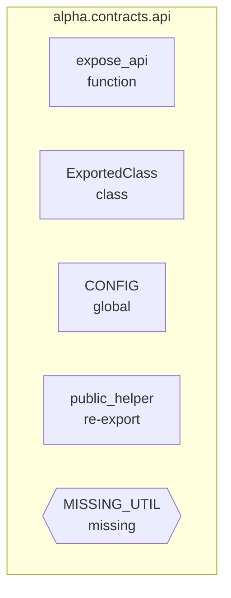

# Export Contract Matrix View Spec

**Status:** Data slice documented and normalization hardened (2025-11-10)

## Goal

Represent each module's public export contract so operators can verify that `__all__` declarations align with locally defined symbols, highlight re-exported helpers, and flag gaps where contracts omit or reference missing entries. The diagram surfaces symbol types (function, class, global, re-export) and exposes origin details to keep API boundaries visible during reviews.

## Inputs

| Source | Fields Used | Notes |
| --- | --- | --- |
| `state.normalizedData.modules` (Map) | `exportSummary`, `moduleId`, `packageName`, `functions` | `exportSummary` consolidates declared symbols, counts by origin, and per-symbol metadata derived from module records. Function identifiers allow cross-linking to function summaries for tooltip details. |
| `moduleRecord.exportSummary` | `declared`, `missing`, `dynamic`, `counts`, `resolved` | Hardened normalization now tracks `__all__` symbols, missing entries, re-export signatures, and linkable IDs. |
| `moduleRecord.exportSummary.resolved[]` | `kind`, `origin`, `defined`, `functionId`, `classQualifiedName`, `valueKind`, `lineno`, `sourceModule`, `sourceName`, `sourceQualifiedName` | Each declared symbol carries its classification, definition status, and supplemental metadata so the builder can map nodes, labels, and warnings. |
| `moduleRecord.functions` (IDs) | n/a | Enables future linking from export nodes to function details when the builder adds drill-down support. |

## Transformations

1. Normalize module-level export data via `buildModuleExportSummary()`, deduplicating declared symbols, unifying `missing` entries, and classifying each declaration as a local definition, re-export, or unresolved reference.
2. Count declared symbols by type (function, class, global, re-export) plus aggregate local totals to highlight modules that expose large surfaces.
3. Capture line numbers, docstring quality, signatures, and value kinds for locally defined entries so tooltips and status panels can surface richer context without re-reading the raw inventory.
4. Preserve re-export provenance (source module, symbol name, qualified path, import kind, and level) for diagram badges and status messaging.
5. Flag missing or unknown entries by marking them `kind: "missing"` with `defined: false` and `origin: "missing"`, enabling the diagram to render warning icons and summary counts.
6. Expose a stable `hasDeclared` flag so the view can hide boilerplate modules that rely solely on dynamic exports.

## Mermaid Output Structure

Nodes reflect symbol types via class-based styling (local functions/classes/globals vs re-exports vs missing). Future iterations will collapse long lists via grouped subgraphs and add edges from re-exports to their source modules when available.

## Implementation References

- `buildModuleExportSummary()` in `.repo_studios/command_center/viewer/ui/viewer.js` aggregates `__all__` entries, resolves local definitions, and tracks re-export provenance.
- Module normalization now stores `exportSummary` alongside import edges and dependency summaries so Dependency pack builders can rely on a stable data contract.
- Helper exports in `viewer.js::__test__` expose `buildModuleExportSummary()` for targeted regression coverage.

## Verification & Hardening

- New regression `.repo_studios/tests/tests_command_center/viewer/test_export_contract_data_normalization.py` asserts export summary normalization across local symbols, re-exports, missing entries, and dynamic contracts.
- Existing dependency normalization tests remain green, confirming alias preservation changes do not alter import behavior.
- Future builder tests will exercise diagram output once controls are wired.

## Future Enhancements

- Enrich `resolved` entries with docstring freshness timestamps and churn overlays once those metrics propagate to module summaries.
- Link export nodes to function/class details in the viewer sidebar for quick drill-down.
- Add grouping heuristics to collapse large export lists (for example `__all__` patterns exposing dozens of imports).
- Surface warnings when modules rely solely on dynamic exports, guiding maintainers toward explicit contract declarations.
