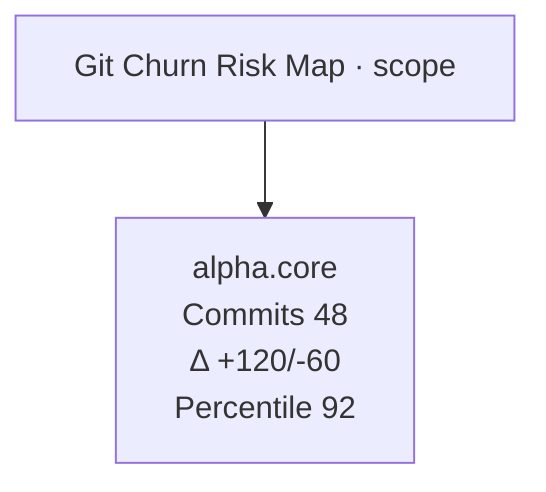

# Git Churn Risk Map View Spec

**Status:** Controls wired with scope-aware fallbacks (2025-11-13)

## Goal

Highlight modules and functions with elevated change frequency so auditors can prioritize risky areas that combine churn with code complexity or coverage gaps. The view will aggregate churn signals captured by the CommandView inventory and surface severity buckets for rapid triage.

## Inputs

| Source | Fields Used | Notes |
| --- | --- | --- |
| `state.normalizedData.modules` (Map) | `moduleId`, `gitChurn`, `functions`, `lineCount`, `coverageSignals` | Supplies per-module churn aggregates, additions/deletions, and function inventories needed for severity scoring. |
| `state.inventoryPayload.statistics.git_churn` | `average_lines_changed`, `median_lines_changed`, `percentiles`, `total_commits` | Provides repository-level baselines for normalization and percentile calculations. |
| `state.normalizedData.functions` (Map) | `id`, `moduleId`, `metrics.coverage`, `cyclomaticComplexity`, `gitChurn` (future) | Optional per-function signals once function-level churn is introduced; initial implementation focuses on module aggregates. |
| Scope helper (planned) | `rootId`, `domainId`, `moduleId` | Will filter modules based on the active zoom selection; placeholder noted for future wiring. |

## Transformations

1. Normalize module collection into a `Map`, discarding entries lacking `gitChurn` metadata.
2. Derive churn severity tiers using repository baselines (e.g., >80th percentile = "critical", 60–80th = "high", 40–60th = "moderate").
3. Combine churn stats with complementary signals (coverage average, complexity) to enrich labels and status messaging.
4. Prepare Mermaid nodes linking the central hub to module nodes, optionally expanding into representative functions for hotspot deep dives.
5. Emit stats summary (module counts per tier, average churn, top offenders) for the viewer sidebar.
6. Surface status details enumerating severity, churn counts, and coverage averages for the displayed modules.

## Mermaid Output Structure (proposed)

## Implementation References

- Producer data: `.repo_studios/command_center/scripts/producers/generate_commandview_inventory.py` populates `git_churn` blocks per module and repository aggregates under `statistics.git_churn`.
- Normalization: `createModuleRecord()` in `.repo_studios/command_center/viewer/ui/viewer.js` already retains `gitChurn` metadata; no additional staging required for data readiness.
- Documentation: Inventory migration guidance updated in `inventory_migration_notes.md` to reference this spec.
- Viewer wiring delegates to `buildGitChurnRiskMapViewDefinition()` inside `viewer/ui/viewer.js`, calling `buildGitChurnRiskMapDiagram()` (`viewer/ui/builders/git_churn_risk_map.js`).

## Verification & Hardening

- Manual inspection: Verified latest CommandView artifact (`*.commandview_YYYYMMDD-HHMM.json`) includes `git_churn` objects with commit counts, additions, deletions, net changes, and recent commit metadata.
- Regression coverage: `.repo_studios/tests/tests_producers/test_generate_commandview_inventory.py::test_inventory_includes_git_churn_summary` safeguards producer output.
- Node-backed regressions `.repo_studios/tests/tests_command_center/viewer/test_git_churn_risk_map_view.py` and `test_git_churn_risk_map_view_definition.py` cover builder determinism, scope fallbacks, and helper telemetry detection.

## Future Enhancements

- Capture per-function churn when inventory emits finer granularity.
- Blend coverage and complexity thresholds into severity scoring to surface compounded risk.
- Introduce time-window filters (e.g., last 30/90 days) once producer supports configurable churn windows.
- Add coexistence regression covering Risk & Assurance pack views once Git Churn and Dead Code diagrams are wired alongside Test Coverage Mapping.
