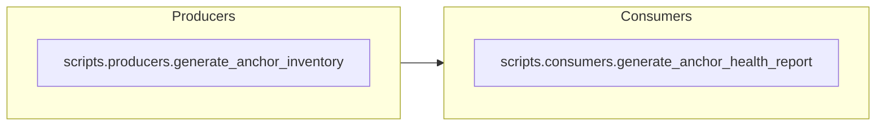

# Layer Architecture Validation View Spec

**Status:** Builder implemented with adjacency validation (2025-11-11)

## Goal

Confirm Repo Studios automation adheres to the mandated execution pipeline — Producers → Consumers → Aggregators → Orchestrators → Summarizers — by rendering each tier as a discrete swimlane and highlighting dependencies that flow in the wrong direction. The view should give operators a fast read on misplaced modules, missing tiers, and cross-layer imports that need remediation before orchestrators run.

## Inputs

| Source | Fields Used | Notes |
| --- | --- | --- |
| `state.normalizedData.modules` (Map) | `layerTier`, `layerLabel`, `layerIndex`, `moduleId`, `relativePath`, `importEdges[]`, `dependencySummary` | `layer*` fields are derived during normalization by matching module IDs and paths to the canonical tier map. `importEdges` supply downstream dependency targets, while `dependencySummary` gives producer-aggregated counts for status messaging. |
| `moduleRecord.importEdges[]` | `target`, `category`, `unused` | Edges classified as `internal` will be compared against tier assignments to flag upstream or lateral violations. |
| `moduleRecord.dependencySummary.violations.layers` | boolean (optional) | Producer inventory already flags layer issues; when present, the builder should surface the producer warning alongside diagram-level validation results. |
| `state.levelSelections` | `rootId`, `domainId`, `moduleId` | Layer diagrams inherit the viewer scope so operators can zoom from repository wide to root/domain/module specific validation as other dependency views do. |

## Transformations

1. Classify each module into a layer tier by inspecting `moduleId`, `relativePath`, and absolute path fragments. The canonical order is Producers (0), Consumers (1), Aggregators (2), Orchestrators (3), Summarizers (4). Modules that do not match the static map are marked `unclassified`.
2. Collapse modules by tier to produce counts, example members, and coverage metrics (imports, functions) for sidebar status notes.
3. Build a directed graph of layer-to-layer relationships using internal import edges. Any edge where `source.layerIndex > target.layerIndex` (backwards flow) or `source.layerIndex < target.layerIndex - 1` (skipping tiers) is flagged as a violation.
4. Pull layer violation hints from `dependencySummary.violations.layers` to enrich status messaging even when current imports look clean.
5. Capture scope-aware stats: number of modules per tier, count of violation edges, and percentage of unclassified modules in the current selection. This feeds `statusMessage` and `statusDetails` once the builder is wired.
6. Surface fallback notices when scoped selections include no tiered modules; fall back to repository view so operators still see the overall architecture.

## Mermaid Output Structure

Each tier renders as a `subgraph` ordered from left to right. Nodes represent modules; edges reflect internal imports. Violations will be styled with alert colors once the builder is added. Large tiers will collapse into summary nodes with drill-down affordances in future iterations.

## Verification & Hardening

- New normalization regression `.repo_studios/tests/tests_command_center/viewer/test_layer_architecture_data_normalization.py` asserts that `createModuleRecord()` assigns the expected `layerTier`, `layerLabel`, and `layerIndex` for producer, orchestrator, and unclassified examples.
- Existing dependency normalization tests remain green, confirming that the added metadata does not alter import parsing or module indexing.
- Builder coverage `.repo_studios/tests/tests_command_center/viewer/test_layer_architecture_data_normalization.py` exercises violation surfacing and scope fallback handling.

## Future Enhancements

- Expand the tier map when additional automation categories (e.g., Utilities) join the validation flow; consider surfacing them in a neutral lane instead of marking them unclassified.
- Integrate lint findings from `validate_import_boundaries.py` to corroborate viewer-derived violations.
- Provide quick links from each tier to the script inventory tables in `.repo_studios/scripts/script_inventory_architecture.md` so remediation owners can jump straight to context.
