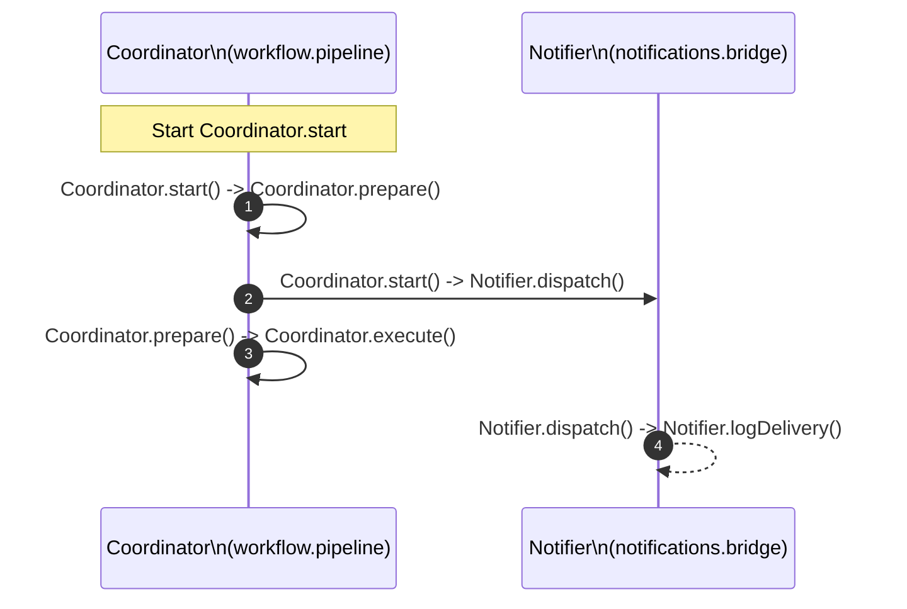

# Method Call Chain View Spec

**Status:** Prototype wired (2025-11-11)

## Goal

Render class-focused method call chains as a Mermaid sequence diagram so operators can inspect orchestrated method hops, confirm delegation boundaries, and spot cross-class fan-out without manually walking the full call graph.

## Inputs

| Source | Fields Used | Notes |
| --- | --- | --- |
| `state.normalizedData.modules` (Map) | `moduleId`, `functions[]` | Supplies module-level function listings for fallback start-method resolution when explicit focus IDs are not provided. |
| `state.normalizedData.functions` (Map) | `id`, `moduleId`, `calls[]`, `metrics.*` | Provides function metadata, outbound edges, and coverage stats; method detection derives class and method names from the function ID (`module::Class.method`). |
| `state.normalizedData.callGraph.functions` (Map) | `sourceId -> [targetId, ...]` | Call graph adjacency list used to traverse downstream method calls. |
| View scope selections | `moduleId`, `allowedFunctionIds`, `focusFunctionId`, `scopeDescription` | Scope filters restrict traversal to relevant methods and control status messaging/fallback notices. |

## Transformations

1. Normalize module, function, and call graph collections to Maps so traversal remains deterministic regardless of input container types.
2. Build a method index by parsing function IDs in the form `module::Class.method`, capturing descriptors (class, module, method names) for each eligible function and honoring allow-list filters.
3. Determine the starting method via explicit focus ID, allow-list ordering, scoped module membership, or finally the first method discovered in the index.
4. Traverse the call graph breadth-first with configurable depth (`maxDepth`, default 4) and branch (`maxBranch`, default 4) limits, recording method-to-method edges and truncation state when limits are hit.
5. Aggregate participants by class so the sequence diagram lists one Mermaid participant per class with module annotations. Annotate the starting class with a note when available.
6. Compute status stats (method count, class count, module count, depth, edge count, start method, truncation flag) and detail lists (call steps, participants, fallback notice) for viewer sidebars.

## Mermaid Output Structure

_Output uses one participant per class, arrows between participants, and notes over the originating class when highlighting the seed method. Self-calls render with `-->>` arrows to distinguish intra-class delegation._

## Implementation References

- Builder `buildMethodCallChainDiagram()` in `.repo_studios/command_center/viewer/ui/builders/method_call_chain.js` implements normalization, traversal, participant aggregation, and status detail assembly.
- Viewer wiring `buildMethodCallChainViewDefinition()` in `.repo_studios/command_center/viewer/ui/viewer.js` validates method availability, applies repository fallbacks, forwards scope filters, and surfaces stats/status panels.
- Helper exports (`collectRepositoryMethodIds`, `resolveMethodFocusedScope`, etc.) inside `viewer.js` support selection fallback and allow-list derivation referenced by the view definition.

## Verification & Hardening

- Regression `.repo_studios/tests/tests_command_center/viewer/test_method_call_chain_view.py` locks builder output, ensuring sequence diagrams, stats, and detail panels remain deterministic.
- Regression `.repo_studios/tests/tests_command_center/viewer/test_method_call_chain_view_definition.py` validates scope fallback messaging, method availability gating, and repository-level fallbacks within the viewer definition.
- Updated coexistence harness `.repo_studios/tests/tests_command_center/viewer/test_code_flow_multi_view_coexistence.py` exercises Method Call Chain toggles alongside Function Call Graph, Entrypoint Trace, Class Inheritance, and Health pack views to guard multi-view stability.

## Future Enhancements

- Surface async/await indicators and decorator signals (e.g., `@staticmethod`) once producers emit method metadata beyond the function ID.
- Highlight recursive edges or repeated class participation in the status details to aid in tracing cyclical delegation.
- Thread coverage or churn overlays into the sequence diagram (e.g., color-coded arrows) as supporting metrics become available.
