# Repo Scripts Tier Overview

This document maps the active automation suite under `.repo_studios/scripts/` using the producer → consumer → aggregator → orchestrator → summarizer tier model. Use it as a quick reference when deciding where a script lives or which upstream artifacts it expects.

## Flowchart

```mermaid
---
title: Repo Scripts Tier Flow
config:
  flowchart:
    curve: straight
    padding: 16
---
flowchart LR
  Root["`.repo_studios/scripts/`"]:::source

  subgraph Producers["Producers"]
    direction TB
    producersHub["Raw artifact generators"]:::category
    p1["analyze_standards_index_gaps.py"]:::script
    p2["check_inventory_health.py"]:::script
    p3["diff_standards_index.py"]:::script
    p4["extract_standards_rules.py"]:::script
    p5["generate_anchor_inventory.py"]:::script
    p6["generate_dependency_hygiene_report.py"]:::script
    p7["generate_import_graph_report.py"]:::script
    p8["generate_lizard_report.py"]:::script
    p9["generate_standards_index.py"]:::script
    p10["generate_typecheck_report.py"]:::script
    p11["render_inventory_views.py"]:::script
    p12["scan_code_placeholders.py"]:::script
    p13["scan_monkey_patches.py"]:::script
    p14["seed_standards_prompts.py"]:::script
    p15["validate_import_boundaries.py"]:::script
    p16["validate_inventory.py"]:::script
    p17["validate_markdown_anchors.py"]:::script
    p18["validate_metrics_anchor_stubs.py"]:::script
    p19["verify_docs_integrity.py"]:::script
    producersHub --> p1
    producersHub --> p2
    producersHub --> p3
    producersHub --> p4
    producersHub --> p5
    producersHub --> p6
    producersHub --> p7
    producersHub --> p8
    producersHub --> p9
    producersHub --> p10
    producersHub --> p11
    producersHub --> p12
    producersHub --> p13
    producersHub --> p14
    producersHub --> p15
    producersHub --> p16
    producersHub --> p17
    producersHub --> p18
    producersHub --> p19
  end

  subgraph Consumers["Consumers"]
    direction TB
    consumersHub["Single-hop analyzers"]:::category
    c1["classify_monkey_patches.py"]:::script
    c2["generate_anchor_health_report.py"]:::script
    c3["generate_fault_artifacts.py"]:::script
    c4["generate_test_log_health_report.py"]:::script
    consumersHub --> c1
    consumersHub --> c2
    consumersHub --> c3
    consumersHub --> c4
  end

  subgraph Aggregators["Aggregators"]
    direction TB
    aggregatorsHub["Multi-source insights"]:::category
    a1["analyze_monkey_patch_trends.py"]:::script
    a2["generate_churn_complexity_heatmap.py"]:::script
    aggregatorsHub --> a1
    aggregatorsHub --> a2
  end

  subgraph Orchestrators["Orchestrators"]
    direction TB
    orchestratorsHub["Run coordination"]:::category
    o1["orchestrate_health_suite.py"]:::script
    o2["run_batch_cleanup.py"]:::script
    o3["run_pytest_log_capture.py"]:::script
    o4["run_standards_index_cli.py"]:::script
    orchestratorsHub --> o1
    orchestratorsHub --> o2
    orchestratorsHub --> o3
    orchestratorsHub --> o4
  end

  subgraph Summarizers["Summarizers"]
    direction TB
    summarizersHub["Narrative outputs"]:::category
    s1["summarize_health_suite.py"]:::script
    s2["summarize_standards.py"]:::script
    summarizersHub --> s1
    summarizersHub --> s2
  end

  subgraph Utilities["Utilities"]
    direction TB
    utilitiesHub["Shared helpers"]:::category
    u1["configure_faulthandler_runtime.py"]:::script
    u2["dump_faulthandler_snapshot.py"]:::script
    u3["refresh_mypy_baselines.py"]:::script
    utilitiesHub --> u1
    utilitiesHub --> u2
    utilitiesHub --> u3
  end

  Root --> producersHub
  Root --> consumersHub
  Root --> aggregatorsHub
  Root --> orchestratorsHub
  Root --> summarizersHub
  Root --> utilitiesHub

  classDef source fill:#ede7ff,stroke:#4b3fd5,stroke-width:1px,font-weight:bold;
  classDef category fill:#e6f3ff,stroke:#0b5fa4,stroke-width:1px,font-weight:bold;
  classDef script fill:#ffffff,stroke:#7a8ca1,stroke-width:0.6px;
```

## Interpretation Notes

- **Root** surfaces the canonical location that now holds the automation suite.
- **Producers** emit the raw artifacts every other tier depends on (inventory snapshots, static analyses, hygiene scans).
- **Consumers** transform a single producer’s output into focused reports or triage bundles.
- **Aggregators** fuse artifacts from multiple producers or consumers to create higher-order insights.
- **Orchestrators** execute script chains, manage retries, and ensure artifacts land in predictable folders.
- **Summarizers** compress sprawling outputs into executive summaries or machine-digestible prompts.
- **Utilities** provide shared runtime helpers and maintenance tooling leveraged across tiers.
