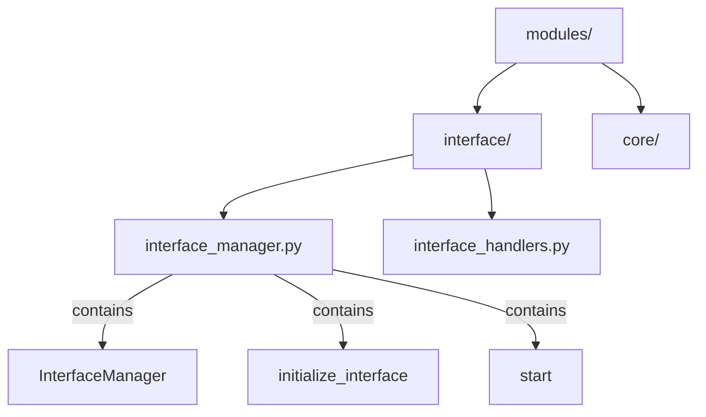

# Phase 6: Future Enhancements & Iteration

## Overview

Phase 6 focuses on continuous improvement of the Function Inventory System based on real-world usage, feedback, and evolving needs.

---

## Enhancement Catalog

### Priority Levels

- **High**: Solves significant pain point, high user value
- **Medium**: Useful improvement, moderate complexity
- **Low**: Nice-to-have, limited impact or high complexity

---

## Enhancement 1: Batch Indexing Command

### Description
Single command to index multiple predefined directories.

### Current State
Must run `make index path=<folder>` for each directory individually.

### Proposed Solution

Add to Makefile:
```makefile
.PHONY: index-all-major
index-all-major:
	@echo "🔍 Indexing all major directories..."
	@make index path=modules || true
	@make index path=agents || true
	@make index path=services || true
	@make index path=tools || true
	@echo "✅ Batch indexing complete"
```

### Usage
```bash
make index-all-major
```

### Benefits
- ✅ Single command for complete refresh
- ✅ Useful for weekly maintenance
- ✅ Simplifies workflow

### Implementation Complexity
**Low** - Simple Makefile addition

### Priority
**High** - Frequently requested, easy to implement

### Status
**Proposed** - Ready for implementation

---

## Enhancement 2: Markdown Output Format

### Description
Generate human-readable `.md` files alongside JSON.

### Current State
Only JSON output, which isn't ideal for human reading.

### Proposed Solution

Add `--format` option to script:
```bash
python3 tools/generate_inventory.py modules --format json,md
```

Output:
- `modules_index/modules_index.json` (machine-readable)
- `modules_index/modules_index.md` (human-readable)

### Example Markdown Output
```markdown
# Function Index: modules

**Generated**: 2025-10-23T14:32:15Z  
**Files**: 15  
**Functions**: 87  
**Classes**: 23  

## 📄 interface_manager.py

### Functions
- `initialize_interface(config)` - line 45  
  *Initialize the interface manager with configuration*

- `start()` - line 78  
  *Start the interface manager main loop*

### Classes

#### InterfaceManager
- `__init__()` - line 20
- `register_handler(event_type, handler)` - line 45
...
```

### Benefits
- ✅ Easy to read and review
- ✅ Good for documentation
- ✅ Can be viewed in VS Code/GitHub directly

### Implementation Complexity
**Medium** - Requires markdown generation logic

### Priority
**Medium** - Useful but not critical

### Status
**Proposed** - Implementation available on request

---

## Enhancement 3: Mermaid Diagram Generation

### Description
Generate visual architecture diagrams.

### Current State
No visual representation of structure.

### Proposed Solution

Add Mermaid diagram output:
```bash
python3 tools/generate_inventory.py modules --format json,mermaid
```

Output: `modules_index/modules_index.mermaid`

### Example Mermaid Output


### Benefits
- ✅ Visual understanding of structure
- ✅ Useful for planning refactoring
- ✅ Can be embedded in documentation

### Implementation Complexity
**Medium-High** - Requires graph generation logic

### Priority
**Low** - Nice-to-have for visualization

### Status
**Proposed** - Lower priority

---

## Enhancement 4: Dependency Graph Tracking

### Description
Track which modules import which, building a dependency graph.

### Current State
Imports are captured but not analyzed for dependencies.

### Proposed Solution

Add dependency analysis to JSON:
```json
{
  "dependencies": {
    "interface_manager.py": {
      "internal_imports": [
        "core.config",
        "utils.logging"
      ],
      "external_imports": [
        "asyncio",
        "pathlib"
      ],
      "imported_by": [
        "main.py",
        "agents/diagnostic.py"
      ]
    }
  }
}
```

### Benefits
- ✅ Understand module coupling
- ✅ Identify circular dependencies
- ✅ Plan refactoring safely

### Implementation Complexity
**High** - Requires import resolution and cross-referencing

### Priority
**High** - Very useful for architectural understanding

### Status
**Proposed** - Significant implementation effort

---

## Enhancement 5: Incremental Updates

### Description
Only re-scan files that changed since last index.

### Current State
Full regeneration every time, even if only one file changed.

### Proposed Solution

Track file modification times:
```json
{
  "metadata": {
    "last_indexed": "2025-10-23T14:32:15Z",
    "file_checksums": {
      "interface_manager.py": "abc123def456"
    }
  }
}
```

Only re-scan files with:
- Changed checksum
- Newer modification time
- Missing from previous index

### Benefits
- ✅ Faster regeneration for large directories
- ✅ Reduces processing time
- ✅ Still produces complete index

### Implementation Complexity
**Medium-High** - Requires checksum tracking and merge logic

### Priority
**Medium** - Useful if performance becomes issue

### Status
**Future** - Wait for performance data

---

## Enhancement 6: Index Validation Command

### Description
Check if indices are out of sync with code.

### Current State
No way to know if indices are stale.

### Proposed Solution

Add validation command:
```bash
make index-validate path=modules
```

Output:
```
✅ modules/interface_manager.py - up to date
⚠️  modules/interface_handlers.py - modified since last index
❌ modules/new_file.py - not in index
```

### Implementation
Check file modification times against index generation time.

### Benefits
- ✅ Know when regeneration needed
- ✅ Catch stale indices
- ✅ Build into CI/CD pipelines

### Implementation Complexity
**Low-Medium** - Simple timestamp comparison

### Priority
**Medium** - Useful for maintenance

### Status
**Proposed** - Easy to add

---

## Enhancement 7: Configuration File

### Description
YAML config file for default settings.

### Current State
All configuration via command-line arguments.

### Proposed Solution

Create `.inventory_config.yaml`:
```yaml
# Jarvis Function Inventory Configuration

# Directories to index with index-all
default_directories:
  - modules
  - agents
  - services
  - tools

# Output formats
output_formats:
  - json

# Options
include_private_functions: false
scan_recursively: true
max_depth: null  # unlimited

# Exclusions
exclude_patterns:
  - "**/test_*.py"
  - "**/*_test.py"
  - "**/conftest.py"
```

### Benefits
- ✅ Project-specific configuration
- ✅ Simplifies command-line usage
- ✅ Consistent team settings

### Implementation Complexity
**Medium** - YAML parsing, config merging

### Priority
**Medium** - Useful for teams

### Status
**Future** - When project grows

---

## Enhancement 8: Pre-commit Hook (Optional)

### Description
Automatically regenerate indices on commit.

### Current State
Manual regeneration only.

### Proposed Solution

Create `.git/hooks/pre-commit`:
```bash
#!/bin/bash
# Auto-regenerate indices for changed Python directories

CHANGED_DIRS=$(git diff --cached --name-only --diff-filter=ACM | \
  grep '\.py$' | xargs dirname | sort -u)

for dir in $CHANGED_DIRS; do
    if [ -d "$dir" ] && [[ "$dir" =~ ^(modules|agents|services)/ ]]; then
        # Extract top-level directory
        top_dir=$(echo "$dir" | cut -d'/' -f1)
        echo "🔍 Regenerating index: $top_dir"
        make index path="$top_dir" 2>/dev/null || true
        git add "${top_dir}/*_index/" 2>/dev/null || true
    fi
done
```

### Benefits
- ✅ Never forget to regenerate
- ✅ Indices always in sync
- ✅ Automatic workflow

### Drawbacks
- ❌ Slows down commits
- ❌ May regenerate unnecessarily
- ❌ Can be annoying during rapid iteration

### Implementation Complexity
**Low** - Simple git hook

### Priority
**Low** - Opt-in feature, not default

### Status
**Available** - User can add manually if desired

---

## Enhancement 9: CI/CD Integration

### Description
Validate indices in CI/CD pipeline.

### Current State
No automated validation.

### Proposed Solution

Add to GitHub Actions / CI pipeline:
```yaml
# .github/workflows/validate-indices.yml
name: Validate Function Indices

on: [pull_request]

jobs:
  validate:
    runs-on: ubuntu-latest
    steps:
      - uses: actions/checkout@v3
      - name: Validate indices are up to date
        run: |
          # Check if Python files changed
          if git diff --name-only origin/main | grep -q '\.py$'; then
            echo "Python files changed, validating indices..."
            
            # Generate fresh indices
            make index-all-major
            
            # Check if indices changed
            if git diff --exit-code '*_index/'; then
              echo "✅ Indices are up to date"
            else
              echo "❌ Indices are out of sync"
              echo "Run: make index-all-major"
              exit 1
            fi
          fi
```

### Benefits
- ✅ Catch stale indices in PR review
- ✅ Enforce consistency
- ✅ Automated quality gate

### Implementation Complexity
**Medium** - Requires CI/CD setup

### Priority
**Low** - For teams with CI/CD

### Status
**Future** - When team grows

---

## Enhancement 10: Web UI Viewer

### Description
Web-based interface to browse indices.

### Current State
Indices must be viewed as JSON or via command-line tools.

### Proposed Solution

Simple Flask/FastAPI web app:
```python
# index_viewer.py
from flask import Flask, render_template, jsonify
import json
from pathlib import Path

app = Flask(__name__)

@app.route('/')
def index():
    # List all available indices
    indices = list(Path('.').rglob('*_index.json'))
    return render_template('index.html', indices=indices)

@app.route('/view/<path:index_file>')
def view_index(index_file):
    with open(index_file) as f:
        data = json.load(f)
    return render_template('viewer.html', data=data)

if __name__ == '__main__':
    app.run(debug=True, port=5000)
```

Browse at: `http://localhost:5000`

### Benefits
- ✅ Interactive exploration
- ✅ Search/filter functions
- ✅ Visual presentation

### Implementation Complexity
**High** - Requires web development

### Priority
**Low** - Nice-to-have for large codebases

### Status
**Future** - Advanced feature

---

## Enhancement Prioritization Matrix

| Enhancement | Priority | Complexity | Effort | Value | Status |
|-------------|----------|------------|--------|-------|--------|
| Batch indexing | High | Low | 1h | High | Ready |
| Markdown output | Medium | Medium | 4h | Medium | Proposed |
| Dependency graph | High | High | 12h | High | Proposed |
| Index validation | Medium | Low | 2h | Medium | Proposed |
| Incremental updates | Medium | High | 8h | Medium | Future |
| Configuration file | Medium | Medium | 4h | Medium | Future |
| Mermaid diagrams | Low | Medium | 6h | Low | Proposed |
| Pre-commit hook | Low | Low | 1h | Low | Available |
| CI/CD integration | Low | Medium | 4h | Low | Future |
| Web UI viewer | Low | High | 16h | Low | Future |

---

## Implementation Roadmap

### Short-term (Next Sprint)

**Week 1-2: Quick Wins**
1. ✅ Implement batch indexing (1 hour)
2. ✅ Add index validation command (2 hours)
3. ✅ Document pre-commit hook option (1 hour)

### Medium-term (Next Quarter)

**Month 1-3: High-Value Features**
1. Markdown output format (4 hours)
2. Dependency graph tracking (12 hours)
3. Configuration file support (4 hours)

### Long-term (Future)

**When needed based on usage:**
- Incremental updates (if performance becomes issue)
- CI/CD integration (when team adopts CI/CD)
- Mermaid diagrams (if visualization needed)
- Web UI (if codebase becomes very large)

---

## Feedback Collection

### Usage Metrics to Track

1. **Frequency**
   - How often indices regenerated?
   - Which directories most frequently indexed?

2. **Performance**
   - Average generation time
   - Index file sizes
   - Any performance complaints?

3. **Workflow**
   - How are users integrating into daily workflow?
   - Are indices being committed regularly?
   - Any friction points?

4. **Value**
   - Subjective Copilot improvement?
   - Time saved vs. time spent?
   - Developer satisfaction?

### Feedback Channels

- User interviews
- Issue tracking
- Usage logs
- Developer surveys

---

## Decision Framework

When considering an enhancement:

### Questions to Ask

1. **Need**: Does it solve a real pain point?
2. **Value**: How many users benefit?
3. **Complexity**: Implementation effort vs. value?
4. **Maintenance**: Ongoing support burden?
5. **Alternatives**: Are there simpler solutions?

### Go/No-Go Criteria

✅ **Implement if:**
- High value, low complexity
- Solves frequently mentioned pain point
- Aligns with system principles
- Maintainable long-term

❌ **Don't implement if:**
- Low value, high complexity
- Edge case with workarounds
- Conflicts with design principles
- High maintenance burden

---

## Enhancement Request Template

For future enhancement proposals:

```markdown
## Enhancement Proposal: [Name]

### Problem Statement
What pain point does this solve?

### Proposed Solution
How would it work?

### Benefits
Why is this valuable?

### Implementation
Technical approach?

### Complexity
Low / Medium / High

### Priority
Based on value and need?

### Alternatives Considered
What else was explored?
```

---

## Long-term Vision

The Function Inventory System should remain:

- **Simple**: Easy to understand and use
- **Fast**: Quick generation times
- **Reliable**: Consistent, predictable behavior
- **Extensible**: Can add features without complexity
- **Valuable**: Measurable improvement to workflow

Future enhancements should support these principles, not complicate them.

---

## Phase 6 Success Criteria

Phase 6 is ongoing, but success looks like:

- ✅ System in active use
- ✅ Feedback collected and analyzed
- ✅ High-priority enhancements identified
- ✅ Roadmap for next improvements
- ✅ Users satisfied with system
- ✅ Measurable productivity gains

---

## Support for Enhancement Requests

To request an enhancement:

1. Review this document to see if already proposed
2. Use enhancement request template above
3. Provide use case and pain point details
4. Suggest priority based on your needs
5. Open discussion with team/maintainer

---

## Conclusion

Phase 6 is about continuous improvement based on real-world usage. The enhancements proposed here are starting points - the actual roadmap should be driven by user needs, feedback, and measured impact.

**Key principle**: Don't add complexity for its own sake. Every enhancement should solve a real problem and provide measurable value.

The Function Inventory System is now in production. Let usage guide its evolution.
